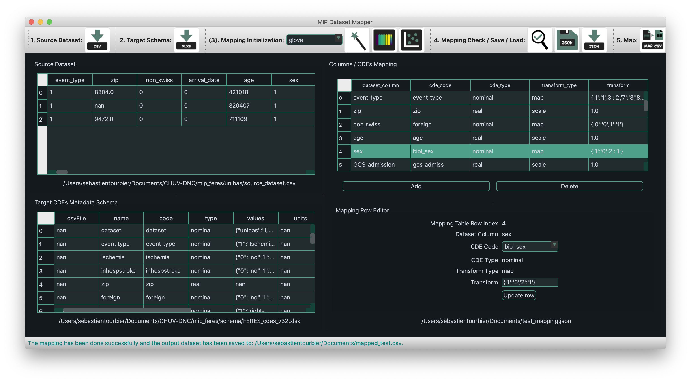

# MIP Dataset Mapper (`mip_dmp`)
<!-- ALL-CONTRIBUTORS-BADGE:START - Do not remove or modify this section -->
[](#contributors-)
<!-- ALL-CONTRIBUTORS-BADGE:END -->

  [](https://doi.org/10.5281/zenodo.8056371)

Python tool with Graphical User Interface to map datasets to a specific Common Data Elements (CDEs) metadata schema of a federation of the Medical Informatics Platform (MIP). It is developed to support members of a MIP Federation in the task of mapping their dataset to the CDEs schema of this federation. This project is distributed under the Apache 2.0 open-source license (See [LICENSE](./LICENSE) for more details).

## How to install?

### For the user

1. Create your installation directory, go to this directory, and create a new virtual Python 3.9 environment:

```bash
$ mkdir -p "/installation/directory"
$ cd "/prefered/directory"
$ virtualenv venv -p python3.9
```

2. Activate the environment and install the package, at a specific version, directly from GitHub with Pip:

```bash
$ source ./venv/bin/activate
(venv) $ pip install git+https://github.com/HBPMedical/mip-dmp.git@0.0.5
```

### For the developer

1. Clone the Git repository in your prefered directory:

```bash
$ cd "/prefered/directory"
$ git clone git@github.com:HBPMedical/mip-datatools.git
```

2. Go to the cloned repository and create a new virtual Python 3.9 environment:

```bash
$ cd mip-datatools
$ virtualenv venv -p python3.9
```

3. Activate the environment and install the package with Pip:

```bash
$ source ./venv/bin/activate
(venv) $ pip install -e .
```

## Usage

### `mip_dataset_mapper_ui`

You can use the installed `mip_dataset_mapper_ui` script to start the MIP Dataset Mapper UI application.

**Usage**

In a terminal, you can launch it with the following command:
```
$ mip_dataset_mapper_ui
```

This displays the main window of MIP Dataset Mapper UI application that consists of four main component in a grid layout fashion, as shown in the screeshot below.



The task of mapping the dataset consists of the following tasks:

- Load a input CSV dataset in `.csv` format (top left)
- Load a CDEs schema in `.xlxs` format (bottom left)
- Edit the columns / CDEs mapping table (top right)
- Configure output directory / filename and create the output CSV dataset mapped to the CDEs schema (bottom right)

### `mip_dataset_mapper`

You can use the installed `mip_dataset_mapper` script to start the command-line interface of the MIP Dataset Mapper.

**Usage**

```output
usage: mip_dataset_mapper [-h] --source_dataset SOURCE_DATASET --mapping_file MAPPING_FILE --cdes_file CDES_FILE --target_dataset
                          TARGET_DATASET

Map a source dataset to a target dataset given a mapping file in JSON format generated by the MIP Dataset Mapper UI application
(mip_dataset_mapper_ui).

optional arguments:
  -h, --help            show this help message and exit
  --source_dataset SOURCE_DATASET
                        Source dataset file in CSV format.
  --mapping_file MAPPING_FILE
                        Source Dataset Columns / Common data elements (CDEs) mapping file in JSON format. The mapping file can be
                        generated by the MIP Dataset Mapper UI application.
  --cdes_file CDES_FILE
                        Common data elements (CDEs) metadata schema file in EXCEL format.
  --target_dataset TARGET_DATASET
                        Path to the target / output dataset file in CSV format.

```

## How to cite?

If you are using the MIP Dataset Mapper (`mip_dmp`) in your work, please acknowledge this software with the following entry:

  > Tourbier, Sebastien, Schaffhauser, Birgit, & Ryvlin, Philippe. (2023). HBPMedical/mip-dmp: v0.0.7 (0.0.7). Zenodo. https://doi.org/10.5281/zenodo.8056371

## Funding

This project received funding from the European Union's H2020 Framework Programme for Research and Innovation under the Specific Grant Agreement No. 945539 (Human Brain Project SGA3, as part the Medical Informatics Platform (MIP)).

## Contributors ✨

Thanks goes to these wonderful people ([emoji key](https://allcontributors.org/docs/en/emoji-key)):

<!-- ALL-CONTRIBUTORS-LIST:START - Do not remove or modify this section -->
<!-- prettier-ignore-start -->
<!-- markdownlint-disable -->
<table>
  <tbody>
    <tr>
      <td align="center" valign="top" width="14.28%"><a href="https://github.com/sebastientourbier"><br /><sub><b>Sébastien Tourbier</b></sub></a><br /><a href="https://github.com/HBPMedical/mip-dmp/issues?q=author%3Asebastientourbier" title="Bug reports">🐛</a> <a href="https://github.com/HBPMedical/mip-dmp/commits?author=sebastientourbier" title="Code">💻</a> <a href="#design-sebastientourbier" title="Design">🎨</a> <a href="https://github.com/HBPMedical/mip-dmp/commits?author=sebastientourbier" title="Documentation">📖</a> <a href="#example-sebastientourbier" title="Examples">💡</a> <a href="#ideas-sebastientourbier" title="Ideas, Planning, & Feedback">🤔</a> <a href="#infra-sebastientourbier" title="Infrastructure (Hosting, Build-Tools, etc)">🚇</a> <a href="#maintenance-sebastientourbier" title="Maintenance">🚧</a> <a href="#mentoring-sebastientourbier" title="Mentoring">🧑‍🏫</a> <a href="https://github.com/HBPMedical/mip-dmp/pulls?q=is%3Apr+reviewed-by%3Asebastientourbier" title="Reviewed Pull Requests">👀</a> <a href="https://github.com/HBPMedical/mip-dmp/commits?author=sebastientourbier" title="Tests">⚠️</a></td>
      <td align="center" valign="top" width="14.28%"><a href="https://github.com/BSchaffhauser"><br /><sub><b>BSchaffhauser</b></sub></a><br /><a href="#financial-BSchaffhauser" title="Financial">💵</a> <a href="#fundingFinding-BSchaffhauser" title="Funding Finding">🔍</a></td>
    </tr>
  </tbody>
</table>

<!-- markdownlint-restore -->
<!-- prettier-ignore-end -->

<!-- ALL-CONTRIBUTORS-LIST:END -->

This project follows the [all-contributors](https://github.com/all-contributors/all-contributors) specification. Contributions of any kind welcome!